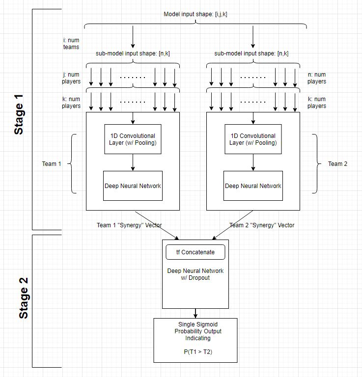

# Pack-Hacks-2021

## Inspiration

Sports continue to be a popular industry in the United States, even in a pandemic. With safety concerns, colleges want to minimize the spectator attendance of games while still appealing to the demand. Our project uses an AI to predict this.

## How it works

We created our deep learning model using the TensorFlow API. We wanted the model to analyze outcomes of historical matches and be able to predict the outcome and attendance of hypothetical matches in the future. We decided that a distinction between a team’s composition and its matchup with another team would be ideal in optimizing the performance of the model. We started by creating 2 individual models that would determine the “synergy” and individual performance of each team. Then we concatenated these 2 models, adding a few final layers to determine the matchup of the 2 teams to determine an overall prediction. 

## Challenges

Originally our plan was to showcase the model working by creating a Football Predictor that would predict various statistics for a football game, such as attendance numbers. This would be an incredibly useful tool for colleges to have during the time of COVID-19, as they can plan safe and fun events when they have an estimate on the amount of people attending. Unfortunately this plan did not come to fruition due to some issues with time, but we hope to implement it down the road.

## What's Next

We hope to improve on the model and add more variables and define new relationships between already existing players—such as quantifying “synergy” between players. We also hope to add functionality to showcase the model, much like the Football Predictor. 
